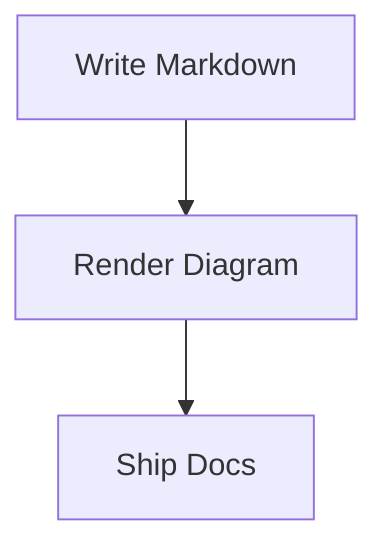

`Mermaid` lets you write diagrams directly in Markdown using fenced code blocks. The theme detects `mermaid` code fences automatically and renders them as diagrams on the page.

## Usage

1. Add a Mermaid code fence to any page, post, or docs document:

````text

````

2. Build or serve the site as usual.

The theme will:

- transform `language-mermaid` code blocks into Mermaid containers
- render them on page load
- re-render them when the selected light, dark, or auto color mode changes

## Example


## Demo

[Live demo](../../demo/mermaid.md){:.btn}

## Additional resources

- [Mermaid documentation](https://mermaid.js.org/intro/)
- [Markdown code fences](https://www.markdownguide.org/extended-syntax/#fenced-code-blocks)
