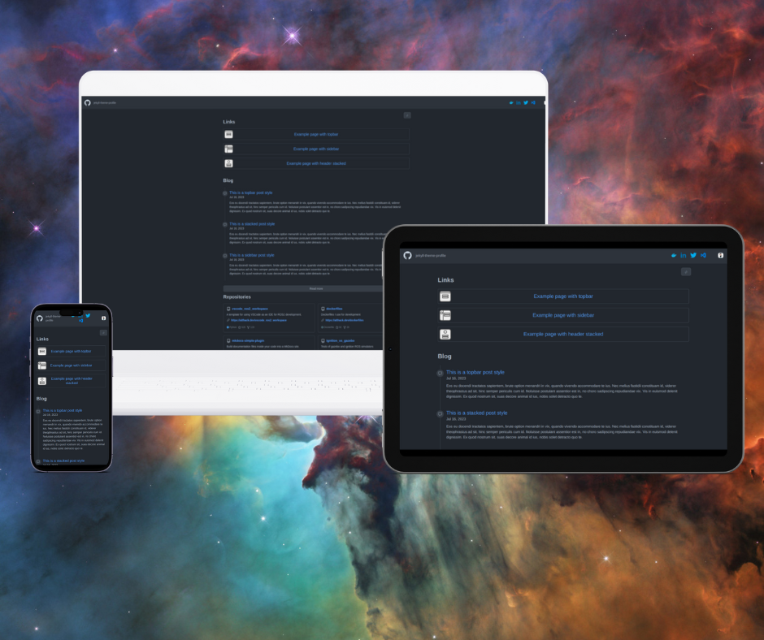
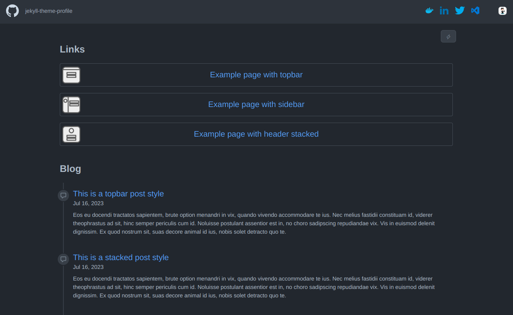

The **topbar** style modifies the theme's header section to provide a clean, GitHub-like navigation experience.  It features

- A fixed top navigation bar
- Consistent spacing and typography matching GitHub's Primer style
- Dark and light mode compatibility

## Usage

You can use this style as a default for your website, or set the style of an individual page.

### Setting as the default style

Modify the `_config.yml` file to set `topbar` as the theme's default style

```yml
style: topbar
```

### Setting the style of a page

To apply the **topbar** style to a specific page, add the following front matter in your `.md` file

```md
---
style: topbar
---
```

## Example usage

See examples of an topbar as a [home](/demo/topbar), [page](/demo/topbar-page) and [post](/demo/topbar-post)



