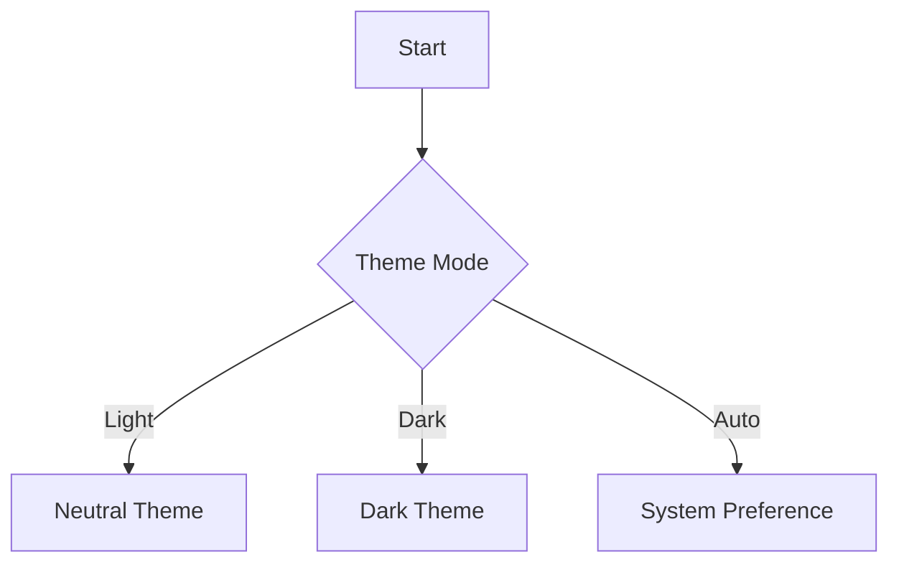
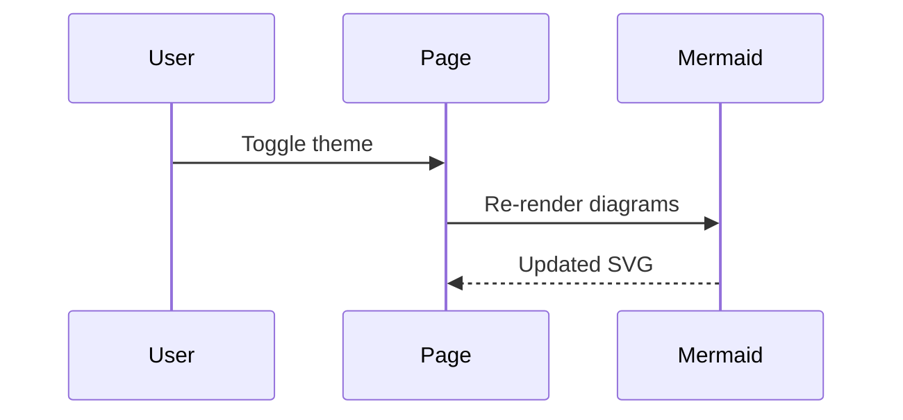
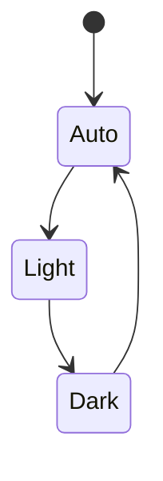

This page verifies that Mermaid diagrams respond to light/dark/auto theme changes.

---

## Flowchart

```mermaid
graph TD
  A[Start] --> B{Theme Mode}
  B -->|Light| C[Neutral Theme]
  B -->|Dark| D[Dark Theme]
  B -->|Auto| E[System Preference]
```

---

## Sequence Diagram

```mermaid
sequenceDiagram
  participant User
  participant Page
  participant Mermaid

  User->>Page: Toggle theme
  Page->>Mermaid: Re-render diagrams
  Mermaid-->>Page: Updated SVG
```

---

## State Diagram

```mermaid
stateDiagram-v2
  [*] --> Auto
  Auto --> Light
  Light --> Dark
  Dark --> Auto
```
